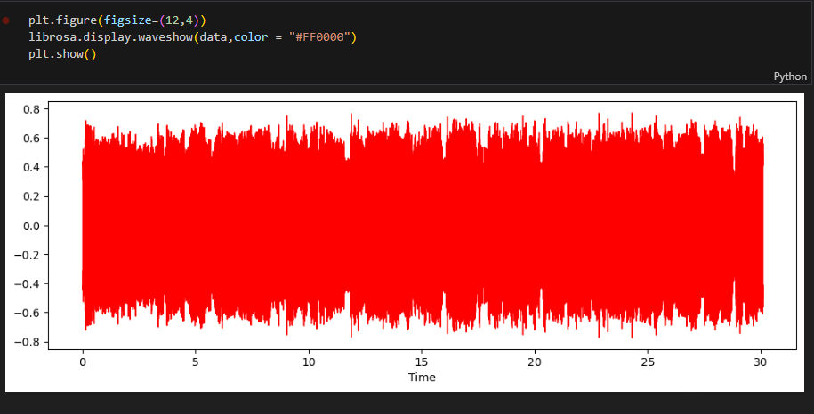
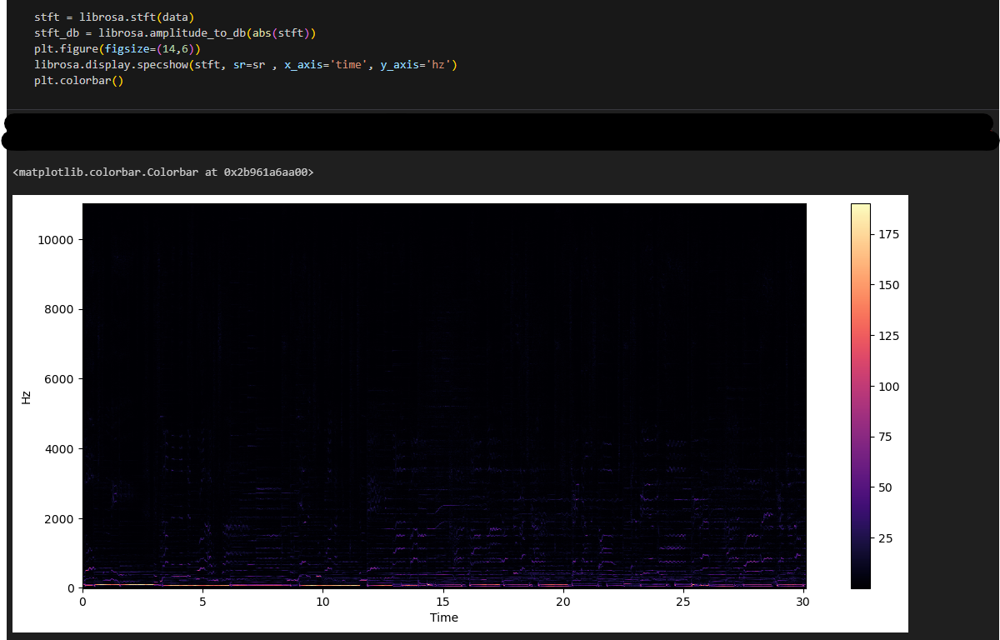
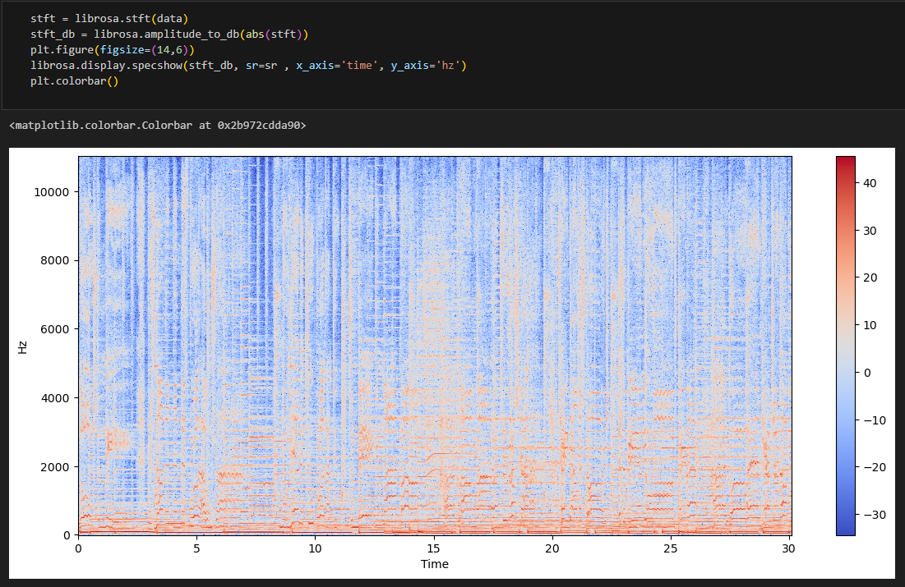
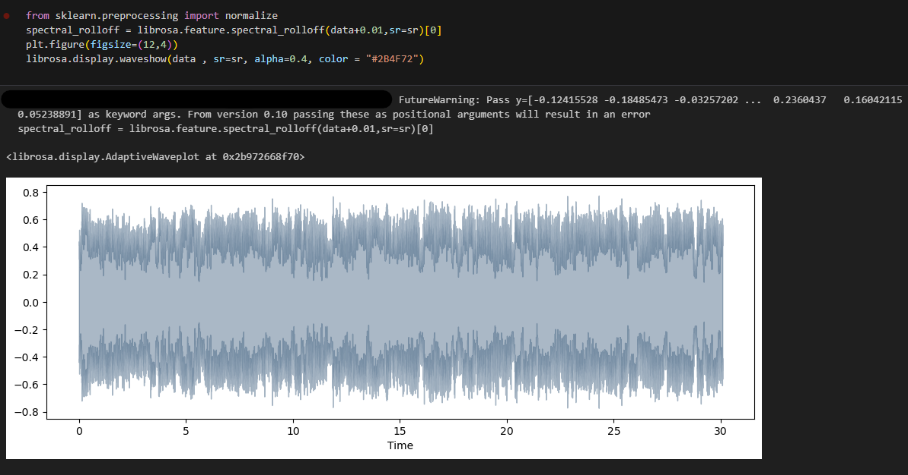
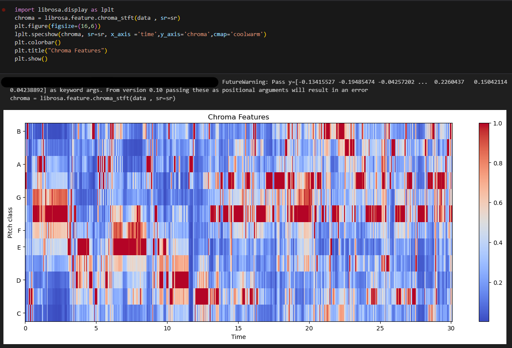
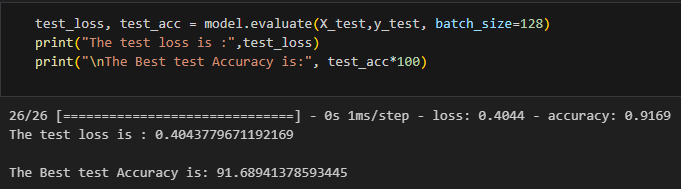
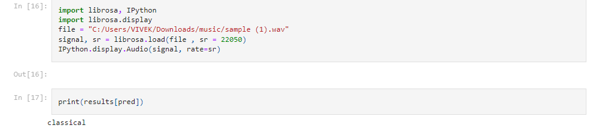

# Music Genre Classification with Machine Learning

Welcome to the Music Genre Classification project! This project utilizes Python, TensorFlow, OpenCV, and other libraries to classify music genres based on audio features.

## Table of Contents
- [Introduction](#introduction)
- [Installation](#installation)
- [Usage](#usage)
- [Project Structure](#project-structure)
- [Results](#results)
- [Contributing](#contributing)
- [License](#license)

## Introduction

In this project, we use machine learning techniques to classify music genres based on audio features. We employ a variety of libraries, including OpenCV, TensorFlow, pandas, and librosa, to process audio data, extract features, and train a classification model.

## Installation

1. Clone this repository:
  
   git clone <repository-url>
   cd music-genre-classification

2. Install the required dependencies:

    pip install pandas numpy matplotlib scipy scikit-learn tensorflow librosa

3. Download the dataset and place it in the appropriate directory.

## Usage

- Run the Jupyter Notebook or Python script to train and evaluate the music genre classification model.
- Visualize audio data, spectrograms, and other relevant features using matplotlib and librosa.
- Tune the model's hyperparameters and architecture for optimal results.

## Project Structure

- `data/`: Directory for storing the dataset.
- `notebooks/`: Jupyter Notebooks for data exploration and model training.
- `src/`: Source code files for data preprocessing, model training, and evaluation.
- `logs/`: TensorBoard logs for model performance tracking.
- `my_model.h5`: Trained model weights file.

## Results

After training the model, you can evaluate its performance and visualize the results using the provided Jupyter Notebook or Python script. Experiment with different hyperparameters and preprocessing techniques to improve the model's accuracy.

 
*Figure 1: Displays Wave Form.*

 
*Figure 2: Color Bar of Amplitude.*

 
*Figure 3: Color Bar : Specshpw Of Amplitude.*

 
*Figure 4: Spectrogram of a music segment.*

 
*Figure 5: Chroma Features*

 
*Figure 6: Performance showing accuracy and loss over epochs.*

 
*Figure 6: Predicting given sample music Gener.*

## Contributing

Contributions to this project are welcome. If you have any suggestions or improvements, please create a pull request.

## License

This project is licensed under the MIT License - see the [LICENSE](LICENSE) file for details.

   
   
